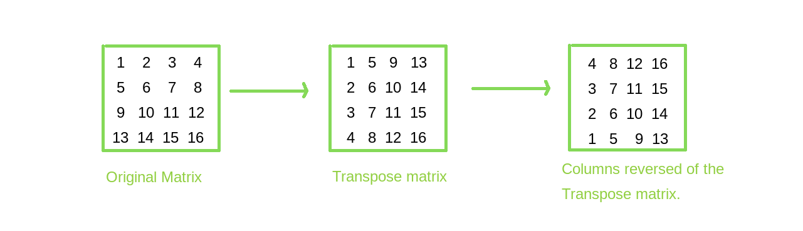
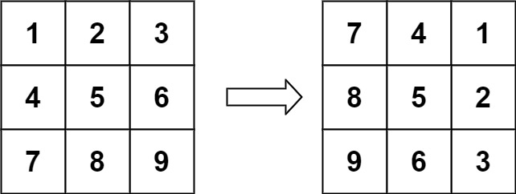
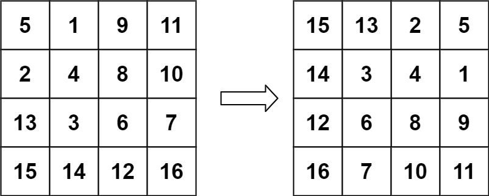

# 48. Rotate Image

**Difficulty:** Medium

## Problem Description

You are given an `n x n` 2D matrix representing an image.

Rotate the matrix **90 degrees clockwise in-place**.

## Objective

Modify the matrix directly without using extra space for another matrix.

## Key Idea

To rotate 90° clockwise:

1. **Transpose the matrix**
    - Convert rows into columns

2. **Reverse each row**
    - This completes the rotation

---

## Approach (In-place)

### Step 1: Transpose

Swap `matrix[i][j]` with `matrix[j][i]` for `j > i`

### Step 2: Reverse Rows

For each row:
- Reverse the row

---

## Example 1

### Input

matrix =  
[[1,2,3],  
[4,5,6],  
[7,8,9]]

---

### Step 1: Transpose

[[1,4,7],  
[2,5,8],  
[3,6,9]]

---

### Step 2: Reverse each row

[[7,4,1],  
[8,5,2],  
[9,6,3]]

---

### Output

[[7,4,1],[8,5,2],[9,6,3]]

---

## Example 2

Input:
[[5,1,9,11],
[2,4,8,10],
[13,3,6,7],
[15,14,12,16]]

Output:
[[15,13,2,5],
[14,3,4,1],
[12,6,8,9],
[16,7,10,11]]

---

## Complexity

- Time: O(n²)
- Space: O(1)

## Constraints

- 1 ≤ n ≤ 20
- -1000 ≤ matrix[i][j] ≤ 1000  