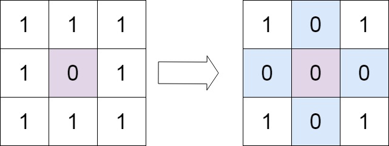
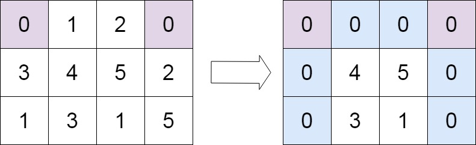

# 73. Set Matrix Zeroes

**Difficulty:** Medium

## Problem Description

Given an `m x n` matrix, if an element is `0`, set its entire **row and column to 0**.

## Objective

Modify the matrix **in-place**.

## Key Idea

- Use the **first row and first column as markers** instead of extra space
- Track separately if first row/column should be zero

---

## Approach (Optimal - O(1) Space)

### Step 1: Check First Row & First Column
- Use flags:
    - `firstRowZero`
    - `firstColZero`

---

### Step 2: Mark Rows & Columns

For each cell `(i, j)`:
- If `matrix[i][j] == 0`:
    - Mark:
        - `matrix[i][0] = 0`
        - `matrix[0][j] = 0`

---

### Step 3: Set Zeroes (Except First Row/Col)

For each cell `(i, j)`:
- If `matrix[i][0] == 0` OR `matrix[0][j] == 0`
    - Set `matrix[i][j] = 0`

---

### Step 4: Handle First Row & Column

- If `firstRowZero` → set entire first row to 0
- If `firstColZero` → set entire first column to 0

---

## Examples

### Example 1

Input:
- matrix = [[1,1,1],
  [1,0,1],
  [1,1,1]]

Output:
- [[1,0,1],
  [0,0,0],
  [1,0,1]]

---

### Example 2

Input:
- matrix = [[0,1,2,0],
  [3,4,5,2],
  [1,3,1,5]]

Output:
- [[0,0,0,0],
  [0,4,5,0],
  [0,3,1,0]]

---

## Complexity

- Time: O(m × n)
- Space: O(1)

## Constraints

- 1 ≤ m, n ≤ 200
- -2³¹ ≤ matrix[i][j] ≤ 2³¹ - 1  