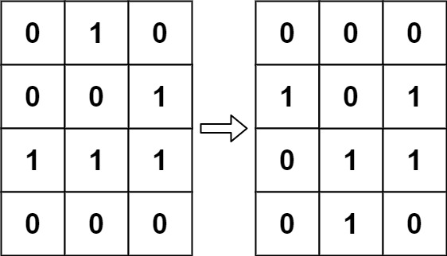
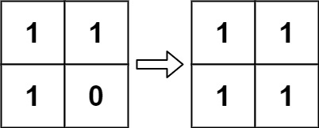

# 289. Game of Life

**Difficulty:** Medium

## Problem Description

Given an `m x n` grid `board` where:
- `1` → live cell
- `0` → dead cell

Update the board to its **next state** based on the rules.

## Rules

1. Live cell with < 2 live neighbors → dies
2. Live cell with 2 or 3 neighbors → lives
3. Live cell with > 3 neighbors → dies
4. Dead cell with exactly 3 neighbors → becomes live

## Objective

Update the board **in-place** while ensuring all updates happen **simultaneously**.

---

## Key Challenge

- Cannot overwrite values directly (affects neighbors)
- Need to preserve original state during computation

---

## Key Idea (In-place Encoding)

Use temporary states:

- `1` → live → stays live
- `0` → dead → stays dead
- `2` → live → dead
- `-1` → dead → live

This lets us:
- Preserve original state
- Compute next state correctly

---

## Approach

### Step 1: Traverse Grid

For each cell:
- Count live neighbors (consider original state)
    - Treat `1` and `2` as originally live

---

### Step 2: Apply Rules

- If cell is live:
    - < 2 or > 3 neighbors → mark `2`
- If cell is dead:
    - == 3 neighbors → mark `-1`

---

### Step 3: Final Pass

Convert:
- `2 → 0`
- `-1 → 1`

---

## Example 1

Input:
[[0,1,0],
[0,0,1],
[1,1,1],
[0,0,0]]

Output:
[[0,0,0],
[1,0,1],
[0,1,1],
[0,1,0]]

---

## Example 2

Input:
[[1,1],
[1,0]]

Output:
[[1,1],
[1,1]]

---

## Complexity

- Time: O(m × n)
- Space: O(1)

---

## Follow-up Notes

### Infinite Grid Handling

- Use:
    - HashSet to track live cells
    - Only process neighbors of live cells

---

## Constraints

- 1 ≤ m, n ≤ 25
- board[i][j] ∈ {0,1}  